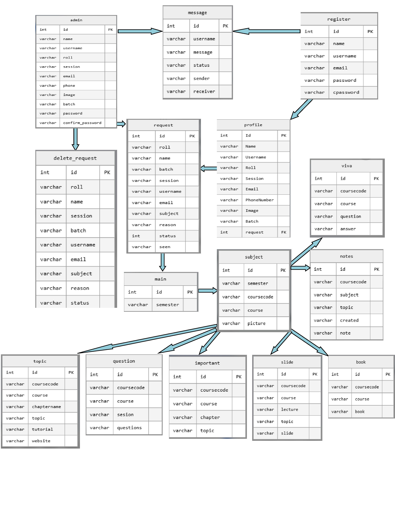
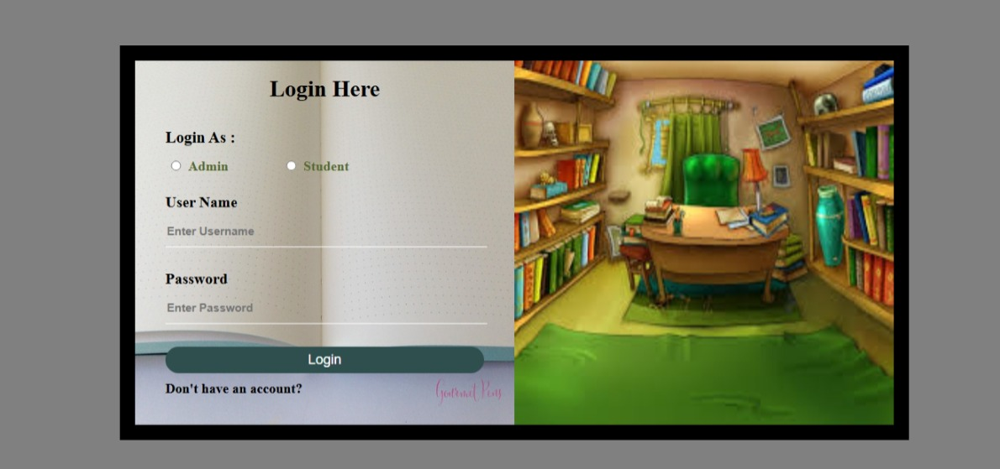

# AcademicHub — Academic Resource Sharing Platform

AcademicHub is a full-stack web application designed to provide students with a centralized platform for sharing, managing, and accessing academic resources. The system organizes course materials such as notes, books, slides, previous-year questions, important topics, and viva questions in one structured platform.

It was developed to address the common problem of fragmented academic resources during coursework and examination preparation.

## 📖 Project Overview

Traditional academic resource sharing often involves materials being scattered across messaging apps, social media, personal drives, and different websites. This makes it difficult for students to find the right resources at the right time.

AcademicHub provides a centralized solution with:

* Structured academic resource organization
* Student-to-student resource sharing
* Role-based administration
* Personal notes management
* Previous-year question resources
* Interactive viva preparation
* Internal messaging
* Controlled resource management

## ✨ Key Features

### 🔐 Authentication & Access Control

* User registration and login
* User profile management
* Role-based access control
* Admin and student functionality
* Request-based permissions for selected management operations

### 📚 Academic Resources

* Books
* Notes
* Slides
* Previous-year questions
* Important questions/topics
* Viva questions
* Course resources
* External learning resources such as YouTube links and articles

Resources are organized according to the academic structure:

**Semester → Subject → Topic/Resource**

### 📝 Personal Notes

Students can:

* Create notes
* Update notes
* Delete notes
* Manage their personal academic notes

### 🎓 Viva Preparation

The platform provides an interactive viva preparation system where users can reveal answers while practicing questions.

### 💬 Internal Messaging

Users can communicate with administrators through the application's internal messaging system.

### 👨‍💼 Administration

The admin panel provides functionality for:

* Managing users
* Managing academic subjects and topics
* Managing books, notes, slides, and questions
* Managing viva questions
* Handling resource requests
* Managing important resources
* Managing user profiles
* Removing inappropriate or unwanted resources

## 🏗️ System Architecture

```text
Frontend
HTML5 + CSS3 + JavaScript
        │
        ▼
Backend
PHP 8
        │
        ▼
Database
MariaDB / MySQL
```

The application follows a traditional server-side web architecture where PHP handles application logic and communicates with the relational database.

### Database Design

The database contains **15 normalized tables** covering:

* User management
* User profiles
* Academic structure
* Resource management
* Notes
* Questions
* Viva preparation
* Messaging
* Requests and permissions

Key relationships include:

* **One-to-One:** Registration ↔ Profile
* **One-to-Many:** Subject → Books, Notes, Slides, Questions, etc.
* **User/Admin Communication:** Internal messaging system

📂 [View Project Structure](./docs/project_structure.md)

## 📋 Database Schema & ERD

The database was designed with normalization and data integrity in mind.

### Core Design Principles

* Normalized relational database design
* Primary and foreign key relationships
* Role-based access control
* Structured academic hierarchy
* Request-based management
* Separation of user and profile information

📄 [View Detailed Database Schema](./docs/database_schema.md)

## 🗂️ Entity Relationship Diagram

The following ERD represents the database structure and relationships between the 15 tables.



## 🎥 Demo

[](https://www.loom.com/share/9a05028b93b64b039b63ae36fc57a426?sid=92d5cd99-9432-45c1-b9dd-caf7578c8be0)

## 🛠️ Technology Stack

| Category            | Technology              |
| ------------------- | ----------------------- |
| Frontend            | HTML5, CSS3, JavaScript |
| Backend             | PHP 8.0.28              |
| Database            | MariaDB 10.4.28         |
| Local Server        | XAMPP                   |
| Database Management | phpMyAdmin              |
| Version Control     | Git & GitHub            |
| Demo Recording      | Loom                    |

## 📁 Project Structure

```text
AcademicHub/
│
├── admin/                  # Admin panel
├── assests/                # CSS and image resources
├── database/               # Database SQL export
├── docs/                   # Project documentation
├── includes/               # Configuration and shared files
├── pages/                  # User panel pages
├── uploads/                # User-uploaded resources (ignored by Git)
│
├── index.php               # Application entry point
├── login.php               # Login page
├── register.php            # Registration page
├── reg.php                 # Registration processing
├── README.md
└── erd.jpg                 # Database ERD
```

> Note: The `uploads/` directory is excluded from GitHub because it contains uploaded application resources.

## 🏃 Installation & Setup

### 1. Install XAMPP

Install XAMPP with Apache, PHP, and MariaDB/MySQL.

### 2. Clone the Repository

Open a terminal and run:

```bash
git clone https://github.com/nahidsultananisaict/Academic-Full-Stack-Project-Course-Resource-Portal-.git
```

### 3. Move the Project to XAMPP

Place the project inside:

```text
C:\xampp\htdocs\
```

The resulting structure should be similar to:

```text
C:\xampp\htdocs\Academic-Full-Stack-Project-Course-Resource-Portal-
```

### 4. Start XAMPP

Open the XAMPP Control Panel and start:

* Apache
* MySQL

### 5. Create the Database

Open phpMyAdmin:

```text
http://localhost/phpmyadmin
```

Create a database for the application.

### 6. Import the Database

Select the newly created database and import:

```text
database/resources.sql
```

### 7. Configure the Database Connection

Create your local:

```text
includes/config.php
```

using the provided configuration template:

```text
includes/config.example.php
```

Enter your local database configuration in `config.php`.

> `config.php` is intentionally excluded from GitHub.

### 8. Run the Application

Open:

```text
http://localhost/Academic-Full-Stack-Project-Course-Resource-Portal-/
```

## 🔒 Security & Git Configuration

The repository intentionally excludes:

```text
uploads/
includes/config.php
```

The `uploads/` directory contains application-uploaded files, while `config.php` contains local database configuration.

A `config.example.php` file is provided as a template.

## 🌱 Future Enhancements

Potential future improvements include:

* AI-based quiz generation from uploaded notes
* Advanced search with filters and tags
* Recommendation system for academic resources
* Mobile application integration
* Gamification with leaderboards and rewards
* Improved resource moderation
* Cloud-based file storage

## 👨‍💻 My Role

I independently designed and implemented the AcademicHub application, including:

* Full-stack web development
* Database schema design
* 15-table normalized relational database
* Entity Relationship Diagram (ERD)
* Frontend development
* Backend development with PHP
* Authentication and user management
* Role-based access control
* Academic resource management
* File upload and management
* Internal messaging system
* Admin dashboard
* Project documentation

## 👤 Author

**Nahid Sultana Nisa**

Full-Stack Developer & Project Owner

[GitHub Profile](https://github.com/nahidsultananisaict)
